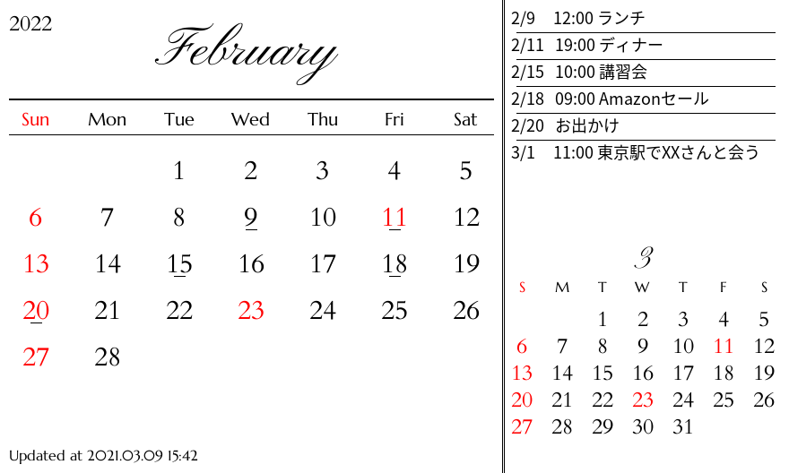
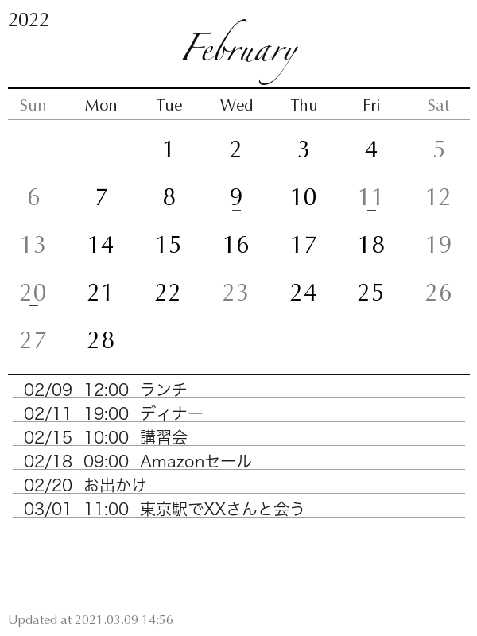

# Calendar Image Generator for e-calendar

E-calendar provides scripts to display the calendar with your schedule on e-paper device.

You are able to get your schedule from Google Calendar via API.

## Installation

Easy to install with poetry.

```zsh
$ git clone https://github.com/mktia/e-calendar.git && cd ./e-calendar
$ poetry install
```

## Usage

Note that these are free fonts in `./Fonts` directory.

### Horizontal and vertical regtangle image

For example, these images are displayed on e-paper.

```zsh
$ python landscape.py
$ python portrait.py
```

Note that [portrait.py](portrait.py) uses default fonts on macOS Big Sur 11.1. If you can't use these, you've to replace the alternative fonts.

## Example

**In reality, the displayed image will be more jagged.**

### Horizontal regtangle



|            |                     |
| ---------- | ------------------- |
| Resolution | 880x528 pixels      |
| Color      | red / black / white |
| Grey scale | 2                   |

### Vertical rectangle



|            |                |
| ---------- | -------------- |
| Resolution | 600x800 pixels |
| Color      | black / white  |
| Grey scale | 16             |

## License

Copyright (c) 2021 mktia.

This software is released under the MIT License, see LICENSE.